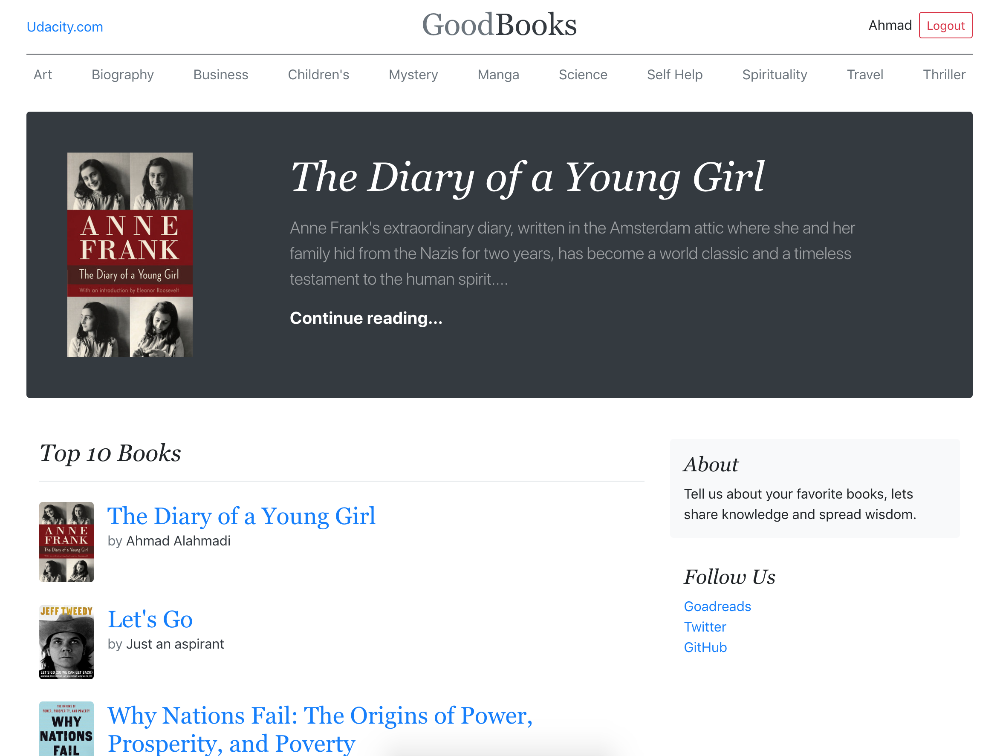

# Item Catalog
This web app is a project for the Udacity [FSND Course](https://www.udacity.com/course/full-stack-web-developer-nanodegree--nd004).

# Screenshot

##  Overview
> To Develop an application that provides a list of items within a variety of categories as well as provide a user registration and authentication system. Registered users will have the ability to post, edit and delete their own items.

## What Will I Learn?
  * Develop a RESTful web application using the Python framework Flask
  * Implementing third-party OAuth authentication.
  * Implementing CRUD (create, read, update and delete) operations.

## How to Install
  1. Clone this rebo
  2. Create a new database
  3. Migrate tables & Seed categories
   `python3 db.py migrate --seed --path database/migrations --seed-path database/seeds`
  4. Configure Google sign-in in app.py  
  5. Install the project requirements `pip3 install -r requirements.txt`
  6. Run application using `python3 app.py`
  7. Access the application locally using http://localhost:5000

## JSON Endpoints
`http://localhost:5000/api/v1/catalog.json` - Returns JSON of all items in categories
